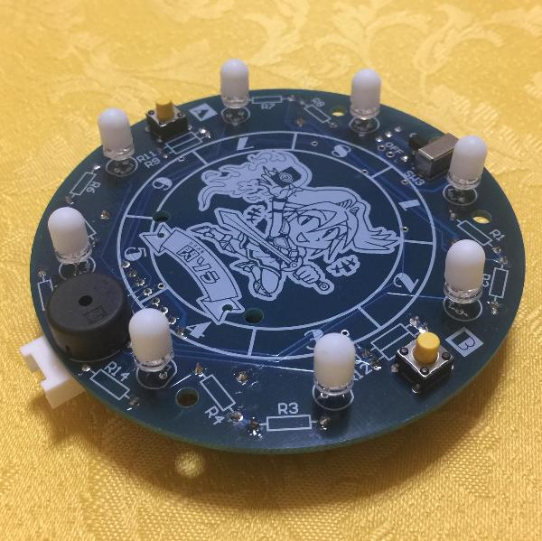

# FlashAir-Roulette

## Overview

I developed and released softwere for FlashAir-Roulette.  
This roulette was designed as FlashAir hands‐on experience for kids & students.  
And the parts kit provided as an extra bonus when FlashAir was purchased at Maker Fair Tokyo 2018.  

The parts list and circuit diagrams are available from the following site.  
 [FlashAir Developers .. Maker Fair Tokyo 2018](https://flashair-developers.com/ja/about/events/makerfaire2018tokyo/)

## Requirement

Check your FlashAir and firmwere version.  
v4.00.03 for W-04 or v3.00.02 for W-03 requires.

## Install

Please save the LUA folder with files in the root folder of FlashAir.

Add the following parameters to FlashAir's /SD_WLAN/CONFIG file.  
Incidentally, /SD_WLAN is a hidden folder,　so let's use a tool that can handle hidden folders.

    LUA_RUN_SCRIPT=/LUA/roulette.lua
    IFMODE=1

## How to play

game1.lua: **Roulette**    
Power on without pressing anything. After about 5 seconds, the No.1 LED lights up.

game2.lua: **Two LED roulette**  
Turn on the power while holding down the A button, and release the No.2 LED lights up.

game3.lua: **Demonstlation lit**  
Hold down the B button and turn on the power, and release the No.3 LED lights up.

game4.lua: **Wi-Fi detector**  
Hold down the A and B buttons and turn on the power, then release the No.4 LED lights up.  
It periodically scans surrounding APs and displays the maximum received power.  
8 is the maximum, 1 is the minimum.

## Licence

[BSD 2-Clause "Simplified" License](https://github.com/AoiSaya/FlashAir-Roulette/blob/master/LICENSE)

## Author

[GitHub/AoiSaya](https://github.com/AoiSaya)  
[Twitter ID @La_zlo](https://twitter.com/La_zlo)
